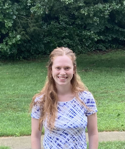

## About Me
I am a postdoctoral researcher in [Dr. Nicola Mueller's lab](https://muellerlab.io/) in the [UC San Francisco EPPIcenter](https://eppicenter.ucsf.edu/). I recently completed my Ph.D. in [Dr. Paul Lewis' lab](https://plewis.github.io/) in the [UConn EEB department](https://eeb.uconn.edu/). My research focuses on statistical phylogenetics. During my Ph.D., I worked on projects developing 1) a novel Bayesian approach to sampling species trees under the multispecies coalescent and 2) a novel method to estimate Bayesian phylogenetic information content.

[My CV](PDFs/cv.pdf)
