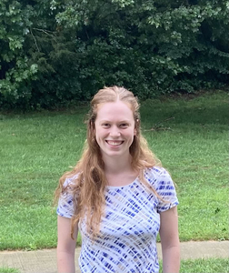

## About Me
I am a PhD student in [Dr. Paul Lewis' lab](https://plewis.github.io/) in the [UConn EEB department](https://eeb.uconn.edu/). My research focuses on statistical phylogenetics. Most recently, I've worked on projects developing (1) a new method of marginal likelihood estimation and (2) a novel Bayesian approach to sampling species trees under the multispecies coalescent.

[My CV](PDFs/cv.pdf)
